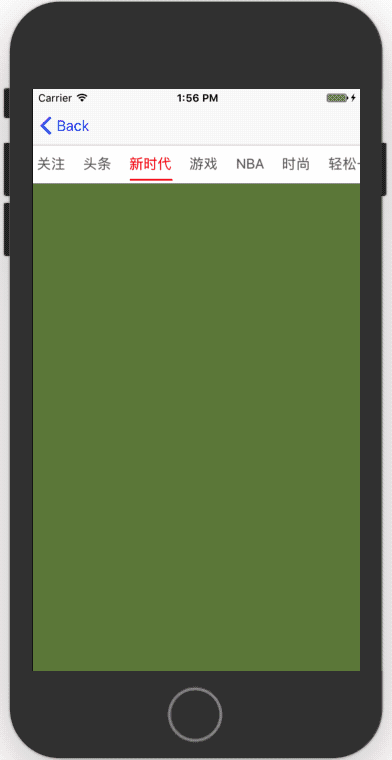
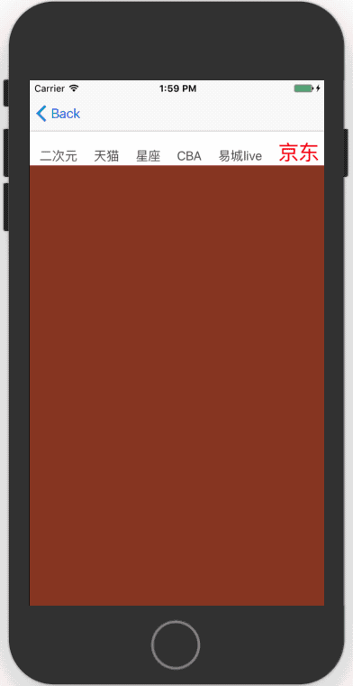
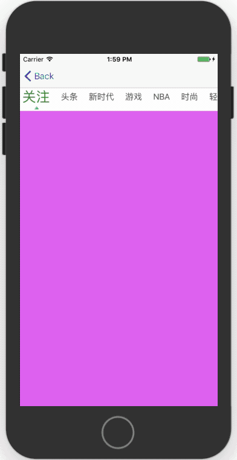

# XWSegmentKit

[](https://travis-ci.org/tianxueweii/XWSegmentKit)
[](https://cocoapods.org/pods/XWSegmentKit)
[](https://cocoapods.org/pods/XWSegmentKit)
[](https://cocoapods.org/pods/XWSegmentKit)

## 简介

`XWSegmentKit`是一个简单易用的二级导航栏（分段控制）组件。你可以通过使用类似`UITableView`的方式来使用它，你只需要进行简单的配置，即可得到你想要的效果。

本项目亮点：

* 60fps流畅切换 🚗
* 平滑的色彩和仿射渐变 💈
* 轻量级简单易用 👶
* 自定义item指针 📌
* 丰富的可配置项 🔧

## 演示





## 安装

你可以从本仓库克隆`Example`工程，并执行`pod install`下载依赖项，示例工程演示了其基本使用方法。

1. 在`Podfile`中添加`pod 'XWSegmentKit'`
2. 执行`$ pod install`或`$ pod update`
3. 导入`<XWSegmentKit/XWSegmentKit.h>`

## 使用

1、导入头文件并遵守`XWSegmentBarDelegate`，`XWSegmentBarDataSource`协议

```objc
#import "XWSegmentKit.h"

@interface XWSegmentStyle1Controller ()<XWSegmentBarDelegate, XWSegmentBarDataSource>

@property (nonatomic, strong) XWSegmentBar *segmentBar;

@end

```

2、初始化`segmentBar`并加载，你可以使用Autolayout、Frame、Flexbox多种方式布局

```objc
- (void)viewDidLoad {
    [super viewDidLoad];
    [self.view addSubview:self.segmentBar];
    // 加载！
    [self.segmentBar xw_segment_update];
}

- (XWSegmentBar *)segmentBar {
    if (!_segmentBar) {
        _segmentBar = [[XWSegmentBar alloc] initWithFrame:CGRectMake(0, [UIApplication sharedApplication].statusBarFrame.size.height + 44, UIMainScreenSize.width, 44)];
        _segmentBar.delegate = self;
        _segmentBar.dataSource = self;
        _segmentBar.autoScroll = YES;
    }
    return _segmentBar;
}
```

3、实现XWSegmentBarDataSource代理方法，提交导航信息

```objc
- (NSInteger)xw_segment_numberOfItems {
    return self.titleArr.count;
}

- (XWSegmentContext *)xw_segment_itemContextAtIndex:(NSInteger)idx {
	
    // 设置对应idx的item上下文，item将根据该上下进行布局和加载
    XWSegmentContext *context = [[XWSegmentContext alloc] init];
   
    context.title = self.titleArr[idx];
    context.font = [UIFont systemFontOfSize:16];
    context.selectedFont = [UIFont systemFontOfSize:16];
    context.selectedColor = UIColor.redColor;
    context.color = UIColor.darkGrayColor;
   
    return context;
}
```

4、实现`XWSegmentBarDelegate`代理方法和`UIScrollViewDelegate`代理方法。如果要达到最佳的现实效果，务必实现`scrollViewDidScroll:`方法进行滚动同步

```objc
#pragma mark - XWSegmentBarDelegate

- (void)xw_segment_didSelectItemAtIndex:(NSInteger)idx {
    [self.collectionView setContentOffset:CGPointMake(UIMainScreenSize.width * idx, 0) animated:YES];
}

#pragma mark - ScrollVeiw Delegate

- (void)scrollViewDidScroll:(UIScrollView *)scrollView {
    [self.segmentBar xw_segment_associatedScrollViewDidScroll:scrollView];
}
```

tip: 你可以通过下载Example工程查看更多用法和设置。例如你可以用熟悉的方式设置segmentBar的内部padding

```objc
- (UIEdgeInsets)xw_segment_padding {
    // 设置左右内边距为5
    return UIEdgeInsetsMake(0, 5, 0, 5);
}
```
## 作者

tianxueweii, 382447269@qq.com

## 许可证

XWSegmentKit 使用 MIT 许可证，详情见 LICENSE 文件。
